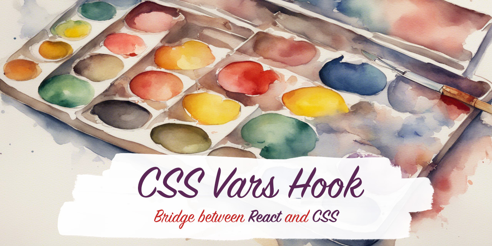

[](https://github.com/morewings/css-vars-hook/actions/workflows/merge-jobs.yml)
[](https://www.npmjs.com/package/css-vars-hook)
[](http://npm-stats.org/#/css-vars-hook)
[](https://github.com/morewings/css-vars-hook)
[](https://bundlejs.com/?q=css-vars-hook@latest&config={"esbuild":{"external":["react","react-dom"]}})

# CSS Variables React hook

[](#)

[css-vars-hook](https://github.com/morewings/css-vars-hook) contains React hooks to set and manipulate CSS custom properties (variables).


[Demo](https://morewings.github.io/css-vars-hook/)

[dev.to article](https://dev.to/morewings/how-to-use-css-vars-hook-to-manipulate-css-custom-properties-in-react-38dg)

## Highlights

- **CSS Variables in React**: manage your component design in a fast and convenient way.
- **Dynamic Theming**: create and manage themes for your application. Apply multiple CSS variables to any HTML element.
- **TypeScript Support**: The library is written in TypeScript, offering type safety and enhancing developer experience.
- **Zero Dependencies**: It operates independently without the need for additional libraries, ensuring a lightweight integration.
- **Performance**: The hook is optimized for performance, with a small footprint that does not impact application speed.

## Install

```shell script
npm install css-vars-hook
```

## Usage

`css-vars-hook` exposes two hooks: `useRootTheme`, `useLocalTheme`. Both of them provide developer a bridge between **React Component state** and **CSS Custom Properties**.

## `useRootTheme`

`useRootTheme` applies application level themes. API consists of two elements: the hook itself and `RootThemeProvider` component which acts as `:root` selector. Directly applying theme to the `:root` is not compatible with Server side rendering (SSR).

## Manipulate theme

### Set up

In order to set global theming you need to wrap your application with `RootThemeProvider` on highest possible level.

```jsx
// App.js
import React from 'react';
import {RootThemeProvider} from 'css-vars-hook';

// Theme object contains dictionary of CSS variables you will use later in your application
const theme = {
    boxColor: 'purple',
    borderColor: 'violet',
}

export const App = () => (
    <RootThemeProvider
        theme={theme}>
        {/*...*/}
    </RootThemeProvider>
);
```

### Memoize theme

To avoid unnecessary reconciliations and re-renders theme object has to **preserve referential equality** during component lifecycle.

```tsx
// Wrong!!! Component will rerender every time

const ComponentA: FC = () => {
    const theme = {
        foo: 'bar'
    }

    return <RootThemeProvider theme={theme}>{/*...*/}</RootThemeProvider>
}

// Wrong!!! Component will rerender every time

const ComponentB: FC = () => {
    return <RootThemeProvider theme={{ foo: 'bar' }}>{/*...*/}</RootThemeProvider>
}

// Correct!!! Theme will preserve untill one of its' properties change

const ComponentC: FC<{foo: string}> = ({foo}) => {

    const theme = useMemo(() => ({foo}), [foo])

    return <RootThemeProvider theme={theme}>{/*...*/}</RootThemeProvider>
}

// Correct!!! Theme is external and static in relation to component

const themeD = {
    foo: 'bar'
}

const ComponentD: FC = () => {
    return <RootThemeProvider theme={themeD}>{/*...*/}</RootThemeProvider>
}
```

### Change theme

Theme changing methods (`setTheme`, `setVariable`, `removeVariable`) are implemented as **effects**. They will apply after component re-render. You'll have to wrap the side effect with `useEffect` or put in inside callback to move it out of the rendering calculation.
```jsx
// Component.jsx
import React, { useEffect, useCallback } from "react";
import { useRootTheme } from 'css-vars-hook';

const theme = {
  boxColor: 'red',
  borderColor: 'green',
}

const Component = () => {
  const { setTheme, setVariable, removeVariable } = useRootTheme();

  // Set theme value inside useEffect hook
  useEffect(() => {
    // Theme changing effects can be applied like this. The change will happen after render.
    setTheme(theme);
  }, [theme, setTheme])

  // Set theme value inside callback
  const handleVariable = useCallback(() => {
    setVariable('boxColor', 'pink');
  }, [])

  return <button onClick={handleVariable}>Change variable</button>;
}
```

### Caveats

```jsx
//...
const Component = () => {
  const { setTheme } = useRootTheme();

  // This will not work!
  setTheme(theme)

  //...
}
```

The reason this code isn’t correct is that it tries to do something with the DOM node during rendering. In React, rendering should be a pure calculation of JSX and should not contain side effects like modifying the DOM. Moreover, when Component is called for the first time, its DOM does not exist yet, so there is no theme container to operate with.


### Type safety

Global theme type should be defined on a project level. You'll have to redeclare `ThemeType` export from `css-vars-hook`

```ts
// types.d.ts
import theme from '@/theme';

declare module 'css-vars-hook' {
    // Provide your global theme type here
    export type ThemeType = typeof theme;
}
```


### Consume the theme data

CSS variables set by `RootThemeProvider` are available globally across all application.

#### In CSS

```postcss
// Component.css

.box {
    background: var(--boxColor);
    border: 1px solid var(--borderColor)
}
```

#### In JS

```js
import {useRootTheme} from 'css-vars-hook';

const {
    /** Get current theme */
    getTheme,
    /** Get variable value within active theme */
    getVariable,
} = useRootTheme();

console.log(getVariable('boxColor')) // => 'purple'
console.log(getTheme()) // => theme object
```

## `useLocalTheme`

`useLocalTheme` applies theme locally to the wrapped React components.

### Set up a local theme

In order to set local theme you need to wrap your component with `LocalRoot` component which is returned by `useLocalTheme` hook.

```jsx
import { useLocalTheme } from 'css-vars-hook';
import { useCallback } from "react";

const theme = { boxColor: 'yellow' };

const Component = () => {
  const { LocalRoot, setTheme } = useLocalTheme();
  const setDarkMode = useCallback(() => {
    setTheme({boxColor: 'darkYellow'})
  }, []);
  return <LocalRoot theme={theme}>{/*...*/}</LocalRoot>
}
```

Outside different wrapping strategies this hook is similar to `useRootTheme`.

### Customize `LocalRoot` element

By default `LocalRoot` is rendered as a `div` HTMLElement. You can provide custom element type (`button`, `span`, e. t. c.) by changing `as` prop of `LocalRoot`.

```jsx
import {useLocalTheme} from 'css-vars-hook';

const theme = {boxColor: 'yellow'};

const Component = () => {
    const {LocalRoot: Button, setTheme} = useLocalTheme();
    const setDarkMode = useCallback(() => {
      setTheme({boxColor: 'darkYellow'})
    }, [])
    return (
      <Button
        theme={theme}
        as="button"
        onClick={setDarkMode}>
        Set dark mode
      </Button>
    )
}
```

### Type safety

Local theme type is inferred from corresponding `LocalRoot` prop.


